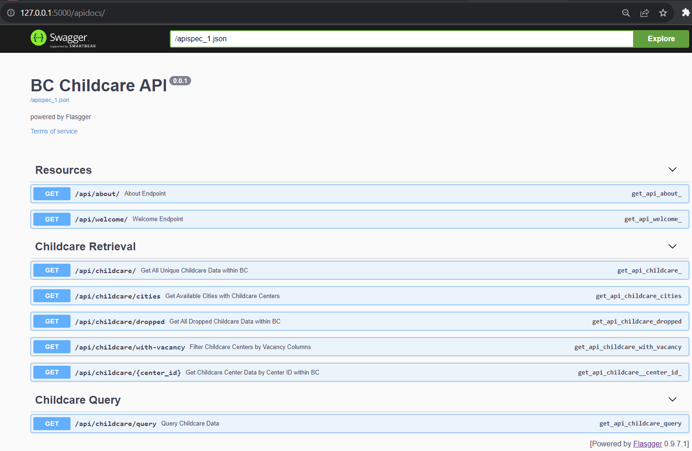

# British Columbia Childcare API

[](https://github.com/caesarw0/BC-ChildCare-API/actions/workflows/update_csv.yml)

## About

The British Columbia Childcare API provides easy access to essential child care information across various locations in British Columbia, Canada.

## Table of Contents

- [British Columbia Childcare API](#british-columbia-childcare-api)
  - [About](#about)
  - [Table of Contents](#table-of-contents)
  - [Installation](#installation)
    - [Local Installation](#local-installation)
  - [Usage](#usage)
    - [1. Resources](#1-resources)
    - [2. Childcare Retrieval](#2-childcare-retrieval)
    - [3. Childcare Query](#3-childcare-query)
  - [Data Sources](#data-sources)
  - [Data Updates](#data-updates)
  - [Contact](#contact)

## Installation

### Local Installation

All the prerequisites and dependencies (e.g., Python packages) are included in the [requirements.txt](requirements.txt) file.

1. To install the necessary packages for this project, please execute the `pip install -r requirements.txt` command in the project main folder.

2. Change the current directory to the `src/` folder of your project and run the flask application:

```bash
cd src

flask --app app.py run
```

3. After running the Flask application, visit [http://127.0.0.1:5000/apidocs/](http://127.0.0.1:5000/apidocs/) in your browser to validate if the application is sucessfully deployed locally (see below).



## Usage

This section explains how to use the British Columbia Childcare API and outlines the three main categories of API functions.

### 1. Resources

The "Resources" category provides metadata about the dataset and its main ideas. You can access this information using the following API endpoints:

- **Endpoint 1**: Retrieve dataset metadata
  - URL: `/api/about`
  - HTTP Method: GET
  - Example Request:
    ```http
    GET /api/about
    ```
  - Example Response:
    ```json
    {
      "message": "this is an API endpoint that uses data from the British Columbia Government",
      "url": "https://catalogue.data.gov.bc.ca/dataset/child-care-map-data/resource/9a9f14e1-03ea-4a11-936a-6e77b15eeb39"
    }
    ```

### 2. Childcare Retrieval

The "Childcare Retrieval" category includes a majority of API endpoints for retrieving childcare center data. This category covers functions such as retrieving all childcare centers and querying by ID. Additionally, it provides information about other features, such as listing available cities.

- **Endpoint 2**: Retrieve all childcare centers
  - URL: `/api/childcare`
  - HTTP Method: GET
  - Example Request:
    ```http
    GET /api/childcare
    ```
  - Example Response:
    ```json
    [
      {
        "ABORIGINAL_PROGRAMMING_YN": "N",
        "ACCOMMODATE_SPECIAL_NEEDS": "N",
        "ADDRESS_1": "2260 Philip Ave",
        "ADDRESS_2": "N/A",
        "CITY": "North Vancouver",
        "ECE_CERTIFICATION_YN": "N",
        "ELF_PROGRAMMING_YN": "N",
        "EMAIL": "N/A",
        "FAC_PARTY_ID": 1,
        "HA_FAC_INSPEC_RPTS": "https://inspections.vcha.ca/ChildCare/Table",
        "IS_CCFRI_AUTH": "Y",
        "IS_DUPLICATE": "N",
        "IS_INCOMPLETE_IND": "N",
        "LANG_CANTONESE_YN": "N",
        "LANG_FRENCH_YN": "N",
        "LANG_MANDARIN_YN": "N",
        "LANG_OTHER_YN": "N",
        "LANG_PUNJABI_YN": "N",
        "LANG_SPANISH_YN": "N",
        "LATITUDE": 49.330395,
        "LONGITUDE": -123.112745,
        "NAME": "Bonnie Bairns Childcare Services",
        "OP_EXT_WEEKDAY_AFTER7PM_YN": "N",
        "OP_EXT_WEEKDAY_BEFORE6AM_YN": "N",
        "OP_OVERNIGHT_YN": "N",
        "OP_STAT_HOLIDAY_YN": "N",
        "OP_WEEKDAY_YN": "N",
        "OP_WEEKEND_YN": "N",
        "PHONE": "604-983-2600",
        "POSTAL_CODE": "V7P 2W8",
        "PRESCHOOL_AFTERNOON_YN": "N",
        "PRESCHOOL_MIDDAY_YN": "N",
        "PRESCHOOL_MORNING_YN": "N",
        "PROVIDE_CD_MEALS": "N/A",
        "PROVIDE_CD_PICKUP": "N/A",
        "SERVICE_TYPE_CD": "Licensed Group",
        "SRVC_30MOS_5YRS_YN": "N",
        "SRVC_LICPRE_YN": "N",
        "SRVC_OOS_GR1_AGE12_YN": "N",
        "SRVC_OOS_KINDER_YN": "N",
        "SRVC_UNDER36_YN": "N",
        "VACANCY_LAST_UPDATE": "2023/09/27",
        "VACANCY_SRVC_30MOS_5YRS": "N",
        "VACANCY_SRVC_LICPRE": "N",
        "VACANCY_SRVC_OOS_GR1_AGE12": "N",
        "VACANCY_SRVC_UNDER36": "N",
        "WEBSITE": "N/A"
      },
      // ... (more data entries omitted for brevity)
    ]
    ```

- **Endpoint 3**: Retrieve childcare center by ID (`FAC_PARTY_ID`)
  - URL: `/api/childcare/{center_id}`
  - HTTP Method: GET
  - Example Request:
    ```http
    GET /api/childcare/10
    ```
  - Example Response:
    ```json
    {
      "ABORIGINAL_PROGRAMMING_YN": "N",
      "ACCOMMODATE_SPECIAL_NEEDS": "N",
      "ADDRESS_1": "6256 Mt Lehman Rd",
      "ADDRESS_2": "N/A",
      "CITY": "Abbotsford",
      "ECE_CERTIFICATION_YN": "N",
      "ELF_PROGRAMMING_YN": "N",
      "EMAIL": "N/A",
      "FAC_PARTY_ID": 10,
      "HA_FAC_INSPEC_RPTS": "http://www.healthspace.ca/fha/childcare",
      "IS_CCFRI_AUTH": "Y",
      "IS_DUPLICATE": "N",
      "IS_INCOMPLETE_IND": "N",
      "LANG_CANTONESE_YN": "N",
      "LANG_FRENCH_YN": "N",
      "LANG_MANDARIN_YN": "N",
      "LANG_OTHER_YN": "N",
      "LANG_PUNJABI_YN": "N",
      "LANG_SPANISH_YN": "N",
      "LATITUDE": 49.115834,
      "LONGITUDE": -122.381674,
      "NAME": "Eco Kids Care Inc.",
      "OP_EXT_WEEKDAY_AFTER7PM_YN": "N",
      "OP_EXT_WEEKDAY_BEFORE6AM_YN": "N",
      "OP_OVERNIGHT_YN": "N",
      "OP_STAT_HOLIDAY_YN": "N",
      "OP_WEEKDAY_YN": "N",
      "OP_WEEKEND_YN": "N",
      "PHONE": "778-549-0766",
      "POSTAL_CODE": "V4X 2G5",
      "PRESCHOOL_AFTERNOON_YN": "N",
      "PRESCHOOL_MIDDAY_YN": "N",
      "PRESCHOOL_MORNING_YN": "N",
      "PROVIDE_CD_MEALS": "N/A",
      "PROVIDE_CD_PICKUP": "N/A",
      "SERVICE_TYPE_CD": "Licensed Group",
      "SRVC_30MOS_5YRS_YN": "N",
      "SRVC_LICPRE_YN": "N",
      "SRVC_OOS_GR1_AGE12_YN": "N",
      "SRVC_OOS_KINDER_YN": "N",
      "SRVC_UNDER36_YN": "N",
      "VACANCY_LAST_UPDATE": "2023/09/15",
      "VACANCY_SRVC_30MOS_5YRS": "N",
      "VACANCY_SRVC_LICPRE": "N",
      "VACANCY_SRVC_OOS_GR1_AGE12": "N",
      "VACANCY_SRVC_UNDER36": "N",
      "WEBSITE": "N/A"
    }
    ```

- **Endpoint 4**: List available cities
  - URL: `/api/childcare/cities`
  - HTTP Method: GET
  - Example Request:
    ```http
    GET /api/childcare/cities
    ```
  - Example Response:
    ```json
    {
    "available_cities": [
        "North Vancouver",
        "Campbell River",
        "Duncan",
        "Victoria",
        "Burnaby",
        "Vancouver",
        // ... (more data entries omitted for brevity)
      ]
    }
    ```

### 3. Childcare Query

The "Childcare Query" category allows users to perform query-based childcare data retrieval. Users can define their own SQL-like queries to filter and retrieve specific data.

- **Endpoint 5**: Perform custom SQL-like queries
  - URL: `/api/childcare/query`
  - HTTP Method: GET
  - Example Request:
    ```http
    GET /api/childcare/query?select=NAME%2CCITY%2CADDRESS_1%2CPOSTAL_CODE%2CFAC_PARTY_ID&where=CITY%3DVancouver
    ```
  - Example Response:
    ```json
    [
      {
        "ADDRESS_1": "1155 Broadway E",
        "CITY": "Vancouver",
        "FAC_PARTY_ID": 9,
        "NAME": "mcgregor Child Care Centre (0 - 3 Gdc)",
        "POSTAL_CODE": "V5T 4V5"
      },
      {
        "ADDRESS_1": "290 - 1200 West  73Rd Ave",
        "CITY": "Vancouver",
        "FAC_PARTY_ID": 13,
        "NAME": "Shannon Day Care",
        "POSTAL_CODE": "V6P 6G5"
      },
      // ... (more data entries omitted for brevity)
    ]
    ```

Use these endpoints to access the data you need from the British Columbia Childcare API.

## Data Sources

The data used in this application is sourced from the British Columbia government's data catalog, specifically from the dataset titled ["Child Care Map Data"](https://catalogue.data.gov.bc.ca/dataset/child-care-map-data/resource/9a9f14e1-03ea-4a11-936a-6e77b15eeb39). The data is provided in CSV format and includes essential information about childcare centers throughout British Columbia, such as their names, addresses, coordinates, and vacancy status.

**Data Update Frequency:** The dataset is updated on a daily basis to ensure that the information remains current and accurate.

**GitHub Actions for Daily Updates:** To keep the data up-to-date, this repository utilizes GitHub Actions. A daily workflow is set up to automatically fetch the latest data from the source CSV and update the dataset within the application.

By leveraging GitHub Actions, this API guarantees that users have access to the most recent childcare information available in British Columbia.

For more details on how data updates are managed, please refer to the [GitHub Actions](#data-updates) section.

## Data Updates

This API is updated daily using GitHub Actions. The data is refreshed from the source CSV file to ensure it remains up-to-date.

The GitHub Actions will compare the current version of the CSV with the latest one and update if necessary. The data update record can be found in the Git commits by [Actions User](https://github.com/actions-user).

## Contact

For any inquiries, further information, or technical support, please feel free to contact us at:

📧 Email: [caesar.wongw@gmail.com](mailto:caesar.wongw@gmail.com)
